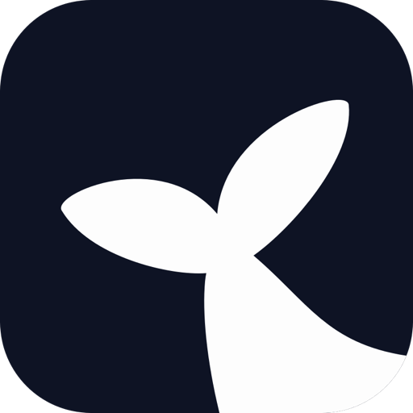
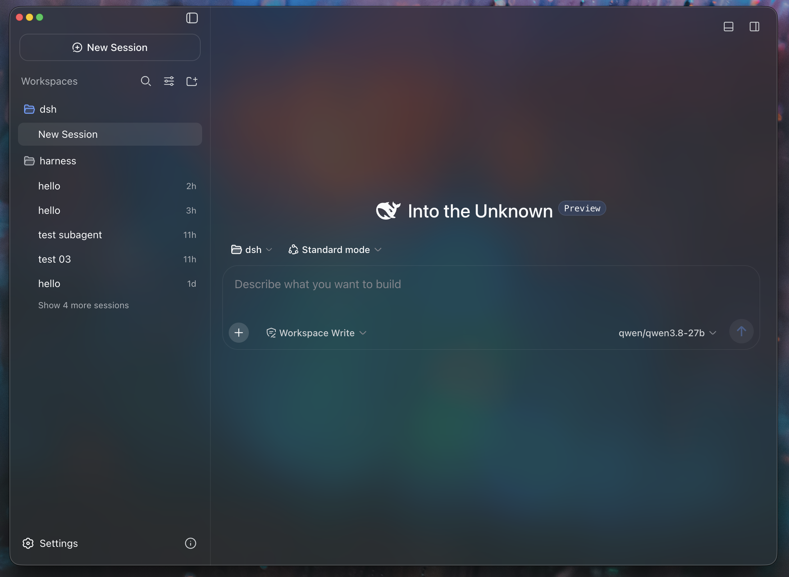
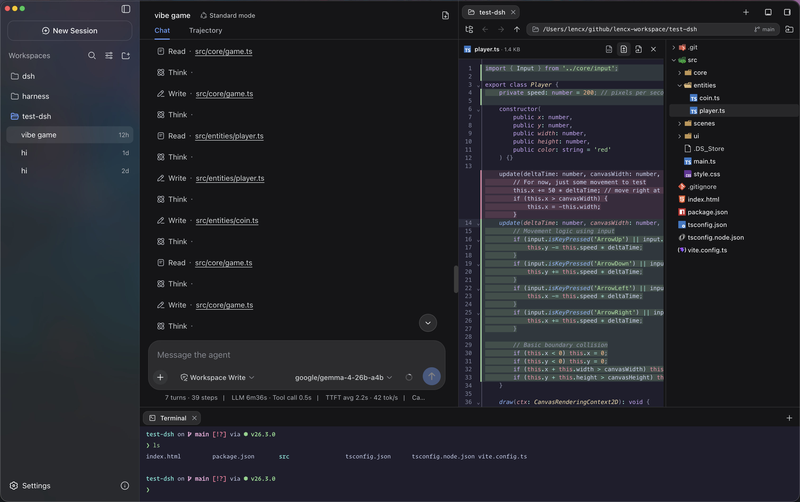
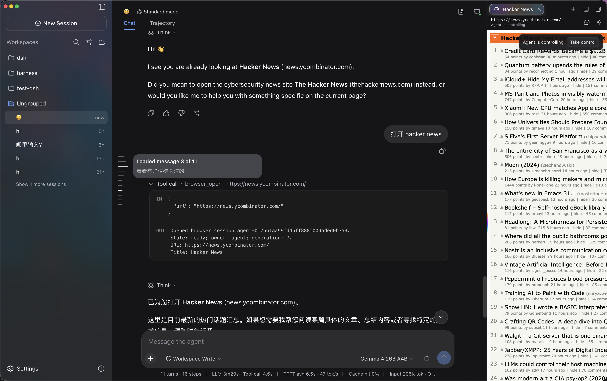
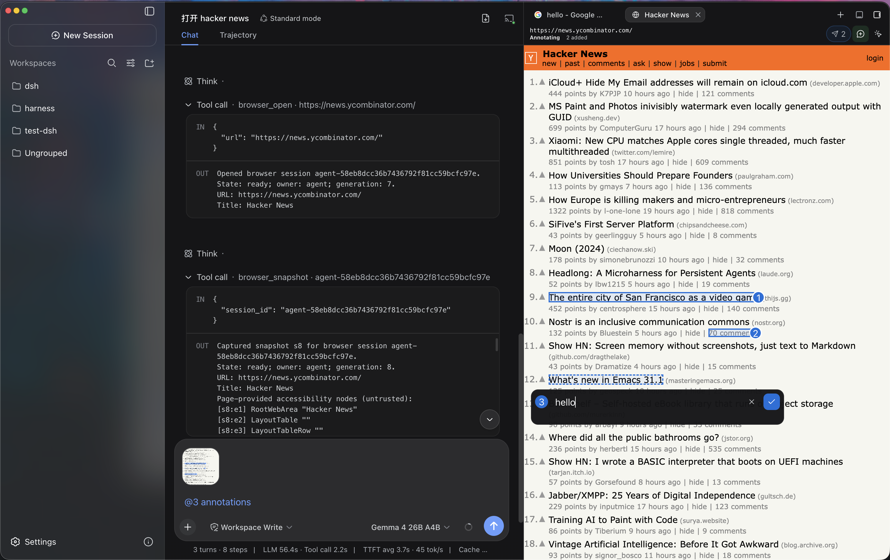
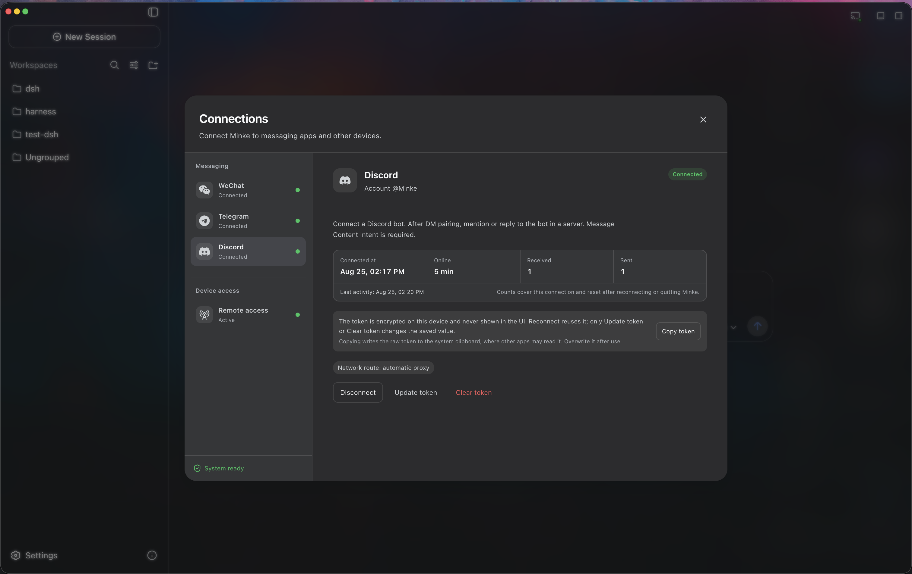
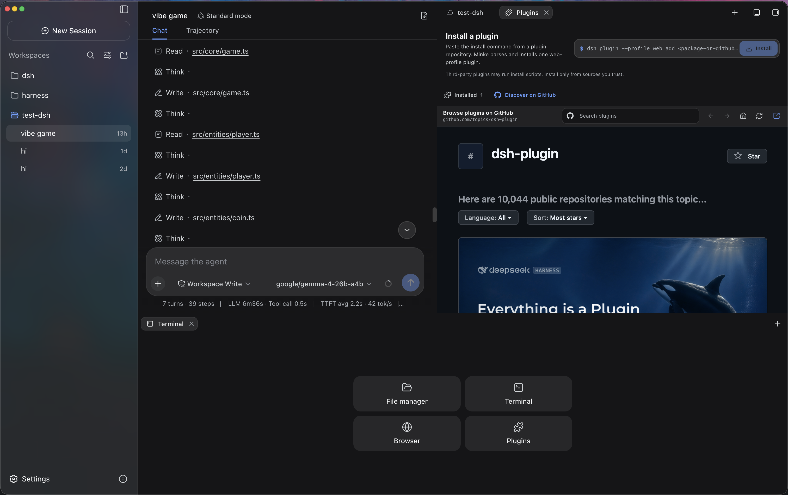
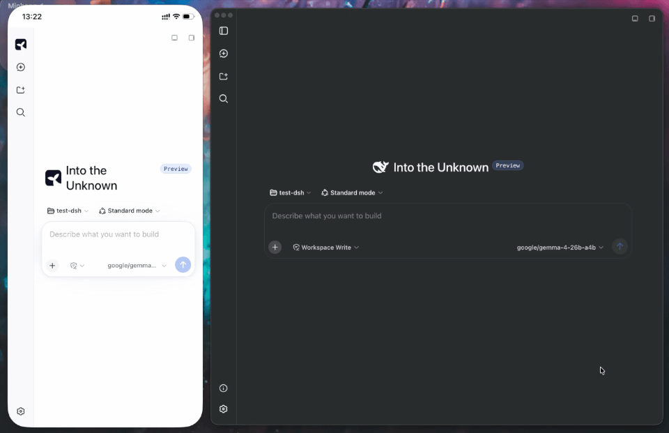

<p align="center">
  
</p>

<h1 align="center">Minke</h1>

<p align="center">
  <strong>为 DeepSeek Harness 打造的原生桌面工作空间</strong>
</p>

<p align="center">
  <a href="./README.md">English</a> · 简体中文
</p>

<p align="center">
  <a href="https://github.com/lencx/Minke/releases"></a>
  <a href="https://discord.gg/XMX5BEX8K"></a>
  <a href="https://x.com/lencx_"></a>
  <a href="https://www.buymeacoffee.com/lencx"></a>
</p>

Minke 在本地运行 [DeepSeek Harness](https://github.com/deepseek-ai/deepseek-harness)，将它带入一个专注、本地优先的智能体桌面工作空间。对话、项目文件、终端、网页工具和原生桌面操作始终触手可及，无需在多个应用之间切换，让工作流保持完整。

> [!IMPORTANT]
> Minke 正在持续开发中，功能、打包方式和本地数据结构可能随项目迭代发生变化。Minke 是独立的社区项目，并非 DeepSeek 官方产品。

## 核心亮点

自 v0.2.0 发布以来，Minke 新增了 Agent Browser、多消息通道远程控制，并完成了全部远程访问链路的端到端回归测试，同时持续打磨桌面工作流。

- **Agent Browser 与人机协作** — 内置免配置 Web 搜索帮助 Agent 找到信息源，Agent Browser 则让它在独立标签页中打开和浏览网站、读取页面结构、点击、输入、按键、等待页面变化并截图。整个过程实时可见，你可以随时接管或交还控制，还能直接标注网页元素，将带截图和页面上下文的反馈发回当前对话。
- **通过微信、Telegram 和 Discord 远程控制** — 扫码连接微信，或通过 Bot Token 接入 Telegram 与 Discord，即可从常用消息应用向 Minke Agent 发起任务并在原会话中接收结果。微信仅接受扫码账号的一对一消息，Telegram 与 Discord 使用私聊配对；凭据加密保存在本机，持久化 Gateway 会在短暂断线或 Agent 暂不可用时保留待处理消息。
- **三种 Web 远程访问均已验证可用** — Tailscale Serve HTTPS、Tailscale Direct IP 和 Cloudflare Access 均已完成端到端测试回归，目前都可以使用，切换配置也无需重启 Minke。远程端是响应式 Web 工作空间，而不是桌面投影；你可以在手机或平板上继续对话、启动 Agent、管理项目文件和使用宿主机终端，并通过 HTTPS 地址安装为 PWA。
- **不只是对话窗口** — 彼此独立的右侧和底部 Tabs，将文件管理器、终端、浏览器、插件和 Session 详情放在当前对话旁边。插件区支持从 GitHub 发现插件，以及安装、状态检查、修复与卸载。文件管理器支持目录浏览、语法高亮预览、编辑与 Diff；终端则连接运行 Minke 的电脑上的真实 PTY。
- **本地模型集成** — Minke 可以发现并连接 LM Studio、Ollama，以及其他仅监听本机回环地址的 OpenAI 兼容服务。可选的生命周期管理能够按需启动受支持的本地运行时，同时不会接管原本已经运行的服务。
- **日常体验持续打磨** — 长对话消息大纲、Composer 快速聚焦、普通网页标签页的元素标注、跨磁盘文件浏览、Telegram 长回复完整投递，以及更清晰的浏览器和连接设置，让高频操作更顺手。全局命令面板（`Mod+K`）、可配置快捷键、原生菜单、Session 历史导航与日志导出、主题同步和中英文界面也都保持可用。
- **安全、可恢复的数据迁移** — 自定义 Minke 数据目录，预览并合并现有 Session、插件与设置。Minke 会去重相同文件、保留冲突和源目录，并只在重启迁移成功后切换；也可以选择从全新数据目录开始。
- **本地优先并覆盖三大平台** — 应用状态和浏览器会话数据保留在本机的 Minke 数据边界内。自动化发布覆盖 macOS、Windows 和 Linux，并提供便携的 AppImage；内置更新流程会校验 Release、文件大小和 SHA-256，再由你确认安装。

<table>
  <tr>
    <td width="50%"></td>
    <td width="50%"></td>
  </tr>
  <tr>
    <td width="50%"></td>
    <td width="50%"></td>
  </tr>
  <tr>
    <td width="50%"></td>
    <td width="50%"></td>
  </tr>
</table>

## 从其他设备远程访问

Minke 的远程访问是由 Minke Host 支撑的响应式 Web 客户端，并不是 Electron
窗口的视频流或触控投影。你可以在手机上继续对话、启动智能体任务、管理项目文件，
并使用实际运行在 Minke 电脑上的终端。



> [!NOTE]
> **Tailscale Serve HTTPS**、**Tailscale Direct IP** 和
> **Cloudflare Access** 均已完成端到端测试回归，目前都可以使用。

- **Tailscale Serve HTTPS（推荐）** — 适合已经加入同一 tailnet 的设备，提供安全的 HTTPS 地址，并支持安装 PWA。
- **Tailscale Direct IP（高级）** — 仅绑定当前设备的 Tailscale IPv4。流量仍由 Tailscale 端到端加密，但访问地址是 HTTP，不属于浏览器安全上下文。
- **Cloudflare Access** — 通过受身份策略保护的 Named Tunnel 从公网访问，手机无需安装 Tailscale；使用前需配置 Cloudflare Tunnel、Access 应用和允许访问的身份。

### 推荐方案：Tailscale Serve

Minke 可以通过 [Tailscale Serve](https://tailscale.com/docs/reference/tailscale-cli/serve) 私密地提供响应式 Web 界面。Harness 仍然只监听本机回环地址，不会暴露到局域网，也不会启用公开的 Tailscale Funnel。

1. 在运行 Minke 的电脑和手机上安装 Tailscale，登录同一个 tailnet，并确认电脑已连接。
2. 打开 Minke 的 **连接 → 设备访问 → 远程访问**，选择 **HTTPS Serve** 并启用远程访问。Minke 会在后台连接，无需重启应用。
3. 在手机上打开界面显示的 `https://…ts.net` 地址。

### 安装为 PWA

通过 Tailscale Serve 或 Cloudflare Access 的 HTTPS 地址打开远程页面，点击侧边栏中的
**安装 Minke**，并接受浏览器的安装提示。在 iPhone 或 iPad 上，请使用
**分享 → 添加到主屏幕**。
安装后会以独立应用模式启动；网络较差时会展示连接中或离线状态，而不是静默展示
缓存的工作空间内容。

Minke 同一时间只启用一条远程链路，并只在应用运行期间持有前台代理，退出时会将其停止。远程页面能够启动 Agent 任务，并使用 Minke 已授权的本机工具，因此请只允许可信的 tailnet 成员或 Cloudflare Access 身份访问。

## 安装

请仅从 Minke 官方 [GitHub Releases](https://github.com/lencx/Minke/releases) 页面下载安装包。

| 平台 | 架构 | 安装包 |
| --- | --- | --- |
| macOS | Apple Silicon（`arm64`） | `.dmg` |
| macOS | Intel（`x64`） | `.dmg` |
| Windows | `x64` | `.exe` |
| Linux | Debian / Ubuntu（`x64`） | `.deb` |
| Linux | Fedora / RHEL（`x64`） | `.rpm` |
| Linux | 便携版（`x64`） | `.AppImage` |

打包后的 macOS、Windows 和 Linux 版本都会自动检查稳定更新。Minke 会为当前系统
选择名称固定的 DMG、EXE、DEB、RPM 或 AppImage，校验 GitHub 不可变 Release、
下载地址链、精确大小、SHA-256 和系统可用的来源属性，再询问是否打开。可在
**设置 → Minke → 个人偏好 → 应用更新** 中关闭后台下载；关闭后必须先确认“下载更新”。
也可随时在 **关于 Minke → 检查更新** 中手动触发。安装过程始终需要用户明确确认。
用户操作和各平台行为见[桌面应用更新说明](./docs/app-updates.md)。

### macOS

1. 下载并打开 `.dmg` 文件。
2. 将 `Minke.app` 拖入“应用程序”目录。
3. 当前预发布版本尚未经过 Apple 公证。请先尝试在 **系统设置 → 隐私与安全性** 中使用 Apple 提供的[“仍要打开”](https://support.apple.com/zh-cn/102445)流程。
4. 仅当你明确接受风险且系统流程不可用时，才对已安装应用的精确路径移除 quarantine：

   ```bash
   xattr -dr com.apple.quarantine "/Applications/Minke.app"
   ```

5. 从“应用程序”目录打开 Minke。

> [!CAUTION]
> 移除 quarantine 属性会绕过一项 macOS 安全检查。Minke 更新器绝不会自动执行该命令。请仅将它作为最后手段，对从官方 Releases 页面下载的 `Minke.app` 使用，并且不要把路径替换为宽泛目录。

#### 微信、Telegram 或 Discord 提示凭据存储不可用

微信、Telegram 和 Discord 共用一个由操作系统凭据保护的加密保险库。在 macOS
上，每次显式授权都会交给一个短生命周期的 Minke 辅助进程，通过 Electron
`safeStorage` 访问钥匙串。取消一次授权不会污染正在运行的桌面进程；再次点击
按钮会启动全新的辅助进程，因此系统可以再次显示授权窗口。

先检查已安装应用：

```bash
codesign --verify --deep --strict --verbose=2 "/Applications/Minke.app"
```

如果校验提示应用包无效或 `Info.plist` 已被修改，可使用下面这一条命令退出
Minke、添加本机临时签名、验证并重新打开应用：

```bash
/usr/bin/osascript -e 'tell application "Minke" to quit' 2>/dev/null || true; while /usr/bin/pgrep -f '^/Applications/Minke\.app/Contents/MacOS/Minke( |$)' >/dev/null; do /bin/sleep 0.2; done; /usr/bin/codesign --force --deep --sign - --timestamp=none "/Applications/Minke.app" && /usr/bin/codesign --verify --deep --strict --verbose=2 "/Applications/Minke.app" && /usr/bin/open "/Applications/Minke.app"
```

macOS 弹出钥匙串授权窗口后，输入 Mac 登录密码并选择**始终允许**。如果
`codesign` 提示权限不足，只在执行签名的命令（`/usr/bin/codesign --force ...`）
前添加 `sudo`。

Minke 不会在启动时访问钥匙串。应用打开后，进入**连接**并点击**授权凭据访问**，
系统才可能显示授权窗口。若选择了**拒绝**，点击**重新请求授权**即可；即使旧版
Electron 状态曾阻止系统再次弹窗，新请求也会从全新的辅助进程开始。Minke 不会
重启，也不会删除凭据、收件箱或待投递记录。

> [!WARNING]
> 该命令会替换已安装应用的现有签名，仅适用于未签名或签名已经无效的预发布构建；
> 不要对 Developer ID 签名且经过 Apple 公证的有效正式版本执行。重新安装或更新
> Minke 后可能需要再次修复。签名只影响钥匙串是否把不同构建识别为同一个应用，
> 与单次授权能否重试无关。不要手动删除 `~/.minke/secrets` 或“钥匙串访问”
> 中的 Minke Safe Storage 项，因为已有通道凭据依赖对应的加密密钥。

### Windows

1. 下载 Windows x64 `.exe` 安装程序。
2. 运行安装程序，并按照界面提示完成安装。
3. 新发布的预览版本可能触发 Windows 信誉安全提示。请先确认安装程序来自 Minke 官方 Releases 页面，再决定是否继续。

### Linux

根据发行版下载对应安装包，可以通过图形化软件管理器打开，也可以在终端中安装。

Debian / Ubuntu：

```bash
sudo apt install "/path/to/minke-package.deb"
```

Fedora / RHEL：

```bash
sudo dnf install "/path/to/minke-package.rpm"
```

请将示例路径替换为实际下载的安装包路径。

## 从源码构建

请在与目标安装包相同的操作系统和 CPU 架构上构建 Minke。构建产物位于 `out/make`，本项目不支持在单一宿主机上进行跨平台打包。

环境依赖：

- 支持 submodule 的 Git，并确保已检出 `vendor/deepseek-harness` 子模块。
- Node.js 24 或更高版本。
- pnpm 11.7.0；执行脚本前需已安装仓库依赖。
- macOS：Apple Silicon 或 Intel Mac，并安装 Xcode Command Line Tools；`.dmg` 只能在 macOS 上构建。
- Windows：Windows x64；如果原生依赖需要在本地编译，可能还需要安装 Visual Studio 2022 Build Tools，并选择 **Desktop development with C++** 工作负载。
- Linux：Linux x64，并安装原生编译工具链、`fakeroot`、`dpkg`，以及 `rpm` 或 `rpm-build`。

首次检出源码并安装仓库依赖后，先准备 Harness runtime：

```bash
pnpm run harness:stage
```

该命令会安装并构建项目固定版本的 DeepSeek Harness 源码，然后将可复用的桌面 runtime 生成到 `runtime/host`。首次检出源码，或固定的 Harness 源码及 runtime 契约发生变化后，需要执行一次。

使用开发模式启动 Minke：

```bash
pnpm start
```

`pnpm start` 会刷新已准备 runtime 中的 Minke 集成，并启动开发应用。

为当前平台生成安装包：

```bash
pnpm make
```

`pnpm make` 会先重新执行一次完整的 runtime 准备流程，再将当前平台的安装包生成到 `out/make`。

macOS 钥匙串按代码签名识别应用。默认的本地包使用临时 ad-hoc 签名，每次源码
变化后都可能被视为新应用；跨版本稳定授权必须使用同一个有效签名证书。可先用
`security find-identity -v -p codesigning` 查找身份，然后在打包进程中设置：

```bash
MINKE_MACOS_SIGN_IDENTITY="Developer ID Application: …" pnpm make
```

CI 使用独立钥匙串时还可设置 `MINKE_MACOS_SIGN_KEYCHAIN`。不要把证书私钥或
钥匙串密码提交到仓库。
